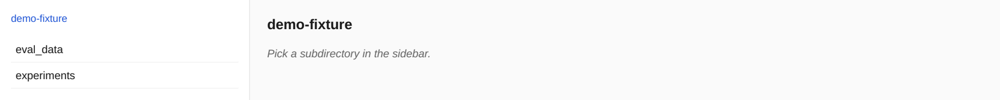
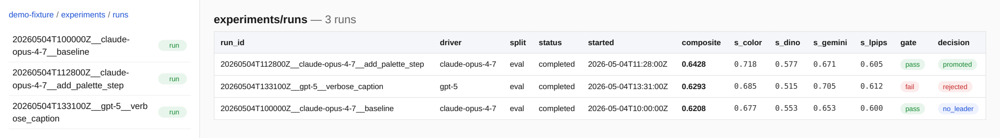
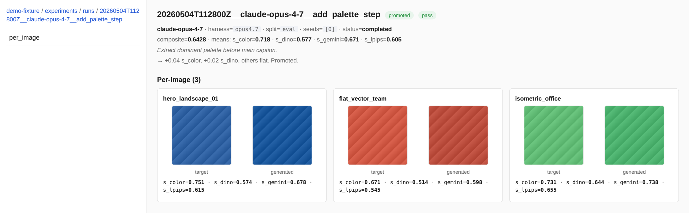
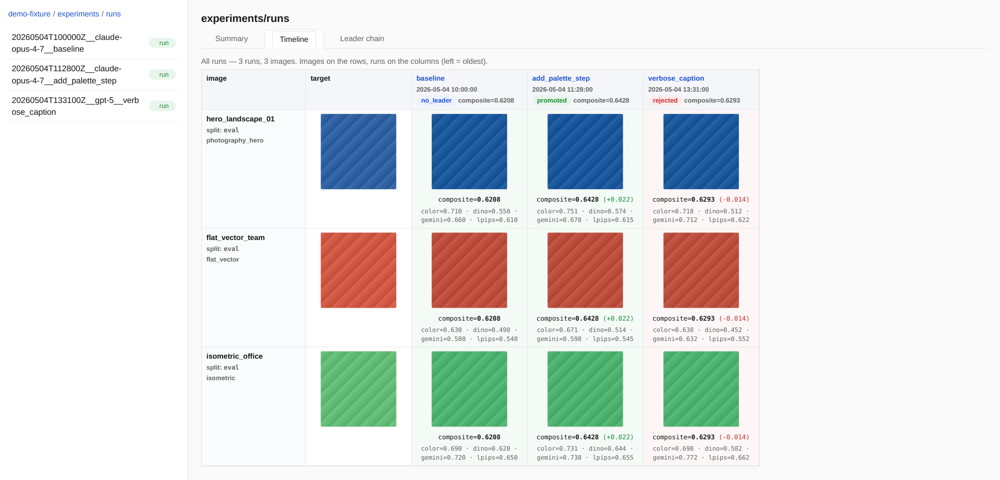
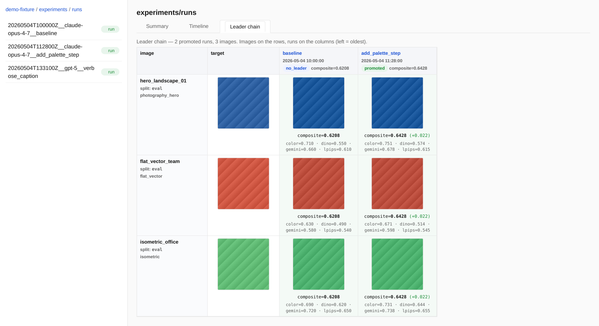

# Image2Prompt Autoresearch Specs

This repo contains self-contained specifications for testing whether coding
agents can build and run an image-to-prompt autoresearch harness.

The core experiment asks:

> Given a target image, can a vision model produce a text prompt that causes a
> fixed image generator to reproduce that image as closely as possible?

Each model-named subfolder is a different version of the task specification.
The repo also includes a helper script that packages one subfolder plus the
public train/eval data into a standalone folder for a test agent.

## Repository Layout

```text
opus4.7/
  program.md              # Instructions for the research/driver agent
  IMPLEMENTATION.md       # Instructions for the implementation agent
  kickoff-prompt.txt      # Shared implementation kickoff prompt
  autoresearch-kickoff-prompt.txt # Shared autoresearch kickoff prompt
  single-repro-prompt.txt # Source prompt notes; not copied into task folders

gpt5.5/
gemini3.1pro/
  ...                     # Same shape, different spec variants

prepare_agent_task.sh     # Creates a standalone task folder
EVAL_STORAGE_SCHEMA.md    # Canonical eval output storage schema
check_eval_storage.py     # Conformance checker (local path or gs:// URI)
storage_backend.py        # Local + GCS backend used by checker and viewer
view_eval_results.py      # Local web viewer for experiment results
sync_runs_to_gcs.py       # Mirror experiment results to GCS
prompts                   # Conversation notes used to create the specs
```

## Browsing Experiment Results

`view_eval_results.py` is a stdlib-only web server that browses experiment
output produced under the schema in `EVAL_STORAGE_SCHEMA.md`. Point it at any
local directory or a `gs://` URI; it auto-detects "this folder contains runs"
and switches between three views.

```bash
python view_eval_results.py --root ./exp_implementation/opus4.7_gpt5.5_baseline
python view_eval_results.py --root gs://image2promptdata/experiments
```

### Folder browser

The sidebar shows whatever subfolders exist under the current path; folders
that contain runs get an `experiments` badge, individual run dirs get a `run`
badge.



### Summary table

Entering a folder that contains runs renders a sortable summary: composite
score, every per-metric mean, gate result, and the gate's promotion decision
as a coloured pill.



### Run detail

Clicking a row shows the run's metadata, hypothesis, takeaway, and a
per-image grid with target vs. generated side-by-side plus the recorded
metric scores. (Demo fixture uses solid colour blocks; real runs show actual
images.)



### Per-image timeline

A **Timeline** tab pivots the runs-container page from a per-run table into a
per-image filmstrip: rows are images, columns are runs (left = oldest), and
each cell shows the generated thumbnail with composite score and a delta vs
the previous shown run. Promoted columns tint green, rejected ones tint red.



A **Leader chain** tab filters the same view to runs whose decision is
`promoted` or `no_leader`, so only the surviving leader trajectory remains
on screen.



The screenshots above were generated against the demo fixture from
`scripts/build_demo_fixture.py`. To reproduce:

```bash
python scripts/build_demo_fixture.py --out /tmp/demo-fixture
python view_eval_results.py --root /tmp/demo-fixture --port 8780 &
python scripts/render_screenshots.py --base http://127.0.0.1:8780 --out docs/screenshots
```

### Deploy to Cloud Run (GCS-only)

`Dockerfile` packages the viewer for Cloud Run, and
`scripts/deploy_cloud_run.sh` builds the image and deploys it. The
container is locked to GCS roots (`VIEWER_GCS_ONLY=1`); the only useful
`--root` value is `gs://bucket/prefix`. Auth uses Application Default
Credentials, which inside Cloud Run resolve to the runtime service
account passed via `--service-account`. Grant that SA
`roles/storage.objectViewer` on the bucket beforehand.

```bash
./scripts/deploy_cloud_run.sh \
  --project my-project \
  --region us-central1 \
  --service image2prompt-viewer \
  --bucket gs://image2promptdata/experiments \
  --service-account viewer-runtime@my-project.iam.gserviceaccount.com
```

By default the Cloud Run service is IAM-protected (`--no-allow-unauthenticated`).
Pass `--allow-unauthenticated` to publish a public URL. The script
prints the service URL on success, plus a sample
`Authorization: Bearer …` curl when the service is private.

Configuration env vars the container reads:

| Env var               | Purpose                                                    |
|-----------------------|------------------------------------------------------------|
| `VIEWER_ROOT`         | `gs://bucket/prefix` to browse (required)                  |
| `PORT`                | Listen port; injected by Cloud Run, defaults to 8080       |
| `VIEWER_HOST`         | Bind address; the image defaults to `0.0.0.0`              |
| `VIEWER_GCS_ONLY`     | When `1`, refuse local roots; the image sets this default  |
| `VIEWER_GCS_CACHE_TTL`| Seconds to cache GCS metadata listings (default `30`)      |

## Data

The train and eval data live in:

```text
gs://image2promptdata/data
```

The helper script copies only:

```text
gs://image2promptdata/data/train -> eval_data/images/eval
gs://image2promptdata/data/eval  -> eval_data/images/val
```

It intentionally does not copy holdout data. Keep holdout private so it can be
used later to evaluate whether an implementation or agent overfit the visible
data.

## Prepare A Standalone Agent Task

Use `prepare_agent_task.sh` to copy one spec subfolder into a local
experiment implementation folder:

```bash
./prepare_agent_task.sh opus4.7 opus4.7_gpt5.5_baseline
```

That creates:

```text
./exp_implementation/opus4.7_gpt5.5_baseline/
```

The standalone experiment folder contains:

- `program.md`
- `IMPLEMENTATION.md`
- `kickoff-prompt.txt`
- `autoresearch-kickoff-prompt.txt`
- `EVAL_STORAGE_SCHEMA.md`
- `check_eval_storage.py`
- implementation-phase agent context files: `AGENTS.md`, `CLAUDE.md`,
  `GEMINI.md`
- `eval_data/images/eval`
- `eval_data/images/val`
- `eval_data/images/manifest.json`

The bucket uses `train`, `eval`, and `holdout` split names. The prepared task
uses the canonical storage schema names: bucket `train` becomes the 30-image
evaluation split at `eval_data/images/eval`, and bucket `eval` becomes the
5-image validation split at `eval_data/images/val`. The schema's `train/` and
`holdout/` directories may stay empty for this harness.

Since some spec variants use older local names, the script may create symlink
compatibility shortcuts when a selected spec mentions them:

```text
target_image.png  # copied from the first image found in eval_data/images/eval
prompt.txt        # starter prompt for single-target specs
```

By default, the script only writes beneath `./exp_implementation/`. You can use
`--root <dir>` or the legacy three-argument form to choose a different root,
but the script still writes only beneath that root's `exp_implementation/`.
The generated experiment folder is overwritten by default. Use `--no-overwrite`
if you want the script to fail instead when the experiment folder already
exists.

## Script Options

```bash
./prepare_agent_task.sh <source-subfolder> <experiment-name> [options]
```

Examples:

```bash
./prepare_agent_task.sh opus4.7 opus4.7_gpt5.5_baseline
./prepare_agent_task.sh gpt5.5 gpt5.5_claude_run01
./prepare_agent_task.sh gemini3.1pro gemini3.1pro_gemini_run01 --skip-data
./prepare_agent_task.sh opus4.7 opus4.7_opus_run02 --root /tmp/custom-task-root
DATA_URI=gs://my-bucket/data ./prepare_agent_task.sh opus4.7 opus4.7_opus_run03
```

Options:

- `--skip-data`: copy only the spec files.
- `--root DIR`: choose a root other than the current directory.
- `--no-overwrite`: fail if the experiment folder exists and is not empty.
- `--overwrite`: replace the experiment folder if it exists. This is the default.

The script uses `gcloud storage rsync` when available, otherwise `gsutil -m
rsync`. Install one of those tools or use `--skip-data`.

## What The Script Excludes

The prepared task folder does not include:

- holdout data
- `single-repro-prompt.txt`

The script creates implementation-phase agent context files instead of
symlinking `program.md` immediately. This avoids auto-loaded driver-agent
instructions conflicting with the implementation kickoff. After the harness is
built, the implementation agent should replace those files with copies or
symlinks to `program.md` for the research/driver session. The script also
copies the canonical eval storage schema and checker from this repo root so the
test agent can implement and validate output persistence without seeing the
rest of the source repo.

## Recommended Workflow

1. Pick the spec variant you want to test, usually `opus4.7` for the most
   complete fixed-harness version.
2. Prepare a fresh task folder:

   ```bash
   ./prepare_agent_task.sh opus4.7 opus4.7_gpt5.5_baseline
   ```

3. Open the generated experiment folder in the coding agent you want to
   evaluate.
4. Paste `kickoff-prompt.txt` into the agent to start the implementation run.
5. After implementation, paste `autoresearch-kickoff-prompt.txt` into the
   research/driver agent to start the experiment loop.
6. Use the visible eval data for smoke tests and development checks.
7. Evaluate final generalization separately with holdout data outside the task
   folder.

Do not point a test agent at this source repo when you want a clean benchmark.
Use a prepared task folder so the agent cannot see source prompt notes or
private holdout data.
